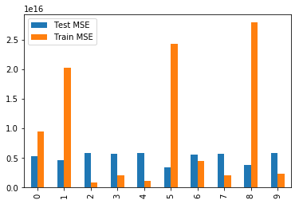
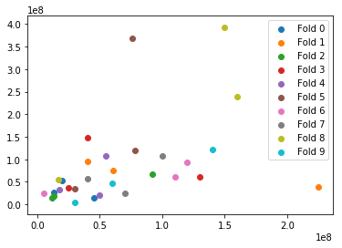

# Cross Validation
We've looked at a range of topics involved with fitting a model to data. This began with the simplest of regression cases and determining criteria for an optimal model, which led us to mean squarred error. From there, we further examined overfitting and underfitting which motivated train test split and later, the bias variance tradeoff. Here, we synthesize many of these ideas into a new sampling, optimization meta-routine known as cross validation. 

A common form of cross validation is known as K-folds. In this process, the dataset is partitioned into K equally sized groups. Each group is then used as a hold out test set while the remaining k-1 groups are used as a training set. This then produces K different models, one for each of the hold out test sets. These models can then be averaged (perhaps a weighted average based on their test set performance) in order to produce a finalized model.

This is also a very useful method for helping to determine the generalization of our models, or the anticipated difference between train and test errors for the model.

## 1. K-Folds
Write a function k-folds that splits a dataset into k evenly sized pieces.
If the full dataset is not divisible by k, make the first few folds one larger then later ones.


```python
def kfolds(data, k):
    #Force data as pandas dataframe
    data = pd.DataFrame(data)
    num_observations = len(data)
    fold_size = num_observations//k
    leftovers = num_observations%k
    folds = []
    start_obs = 0
    for fold_n in range(1,k+1):
        if fold_n <= leftovers:
            #Fold Size will be 1 larger to account for leftovers
            fold =  data.iloc[start_obs : start_obs+fold_size+1] 
            folds.append(fold)
            start_obs +=  fold_size + 1
        else:
            fold =  data.iloc[start_obs : start_obs+fold_size] 
            folds.append(fold)
            start_obs +=  fold_size
            
    return folds #folds should be a list of subsets of data
```

## 2. Cross Validation
* Split your dataset into 10 groups using your kfolds function above.
* Perform linear regression on each and calculate the training and test error. 
* Create a simple bar chart to display the various train and test errors for each of the 10 folds.


```python
import pandas as pd
from sklearn.linear_model import LinearRegression
import matplotlib.pyplot as plt
%matplotlib inline
import numpy as np
```


```python
df = pd.read_excel('movie_data_detailed_with_ols.xlsx')
X_feats = ['budget', 'imdbRating',
       'Metascore', 'imdbVotes']
y_feat = 'domgross'
df.head()
```


<div>
<style scoped>
    .dataframe tbody tr th:only-of-type {
        vertical-align: middle;
    }

    .dataframe tbody tr th {
        vertical-align: top;
    }

    .dataframe thead th {
        text-align: right;
    }
</style>
<table border="1" class="dataframe">
  <thead>
    <tr style="text-align: right;">
      <th></th>
      <th>budget</th>
      <th>domgross</th>
      <th>title</th>
      <th>Response_Json</th>
      <th>Year</th>
      <th>imdbRating</th>
      <th>Metascore</th>
      <th>imdbVotes</th>
      <th>Model</th>
    </tr>
  </thead>
  <tbody>
    <tr>
      <th>0</th>
      <td>13000000</td>
      <td>25682380</td>
      <td>21 &amp;amp; Over</td>
      <td>0</td>
      <td>2008</td>
      <td>6.8</td>
      <td>48</td>
      <td>206513</td>
      <td>4.912759e+07</td>
    </tr>
    <tr>
      <th>1</th>
      <td>45658735</td>
      <td>13414714</td>
      <td>Dredd 3D</td>
      <td>0</td>
      <td>2012</td>
      <td>0.0</td>
      <td>0</td>
      <td>0</td>
      <td>2.267265e+05</td>
    </tr>
    <tr>
      <th>2</th>
      <td>20000000</td>
      <td>53107035</td>
      <td>12 Years a Slave</td>
      <td>0</td>
      <td>2013</td>
      <td>8.1</td>
      <td>96</td>
      <td>537525</td>
      <td>1.626624e+08</td>
    </tr>
    <tr>
      <th>3</th>
      <td>61000000</td>
      <td>75612460</td>
      <td>2 Guns</td>
      <td>0</td>
      <td>2013</td>
      <td>6.7</td>
      <td>55</td>
      <td>173726</td>
      <td>7.723381e+07</td>
    </tr>
    <tr>
      <th>4</th>
      <td>40000000</td>
      <td>95020213</td>
      <td>42</td>
      <td>0</td>
      <td>2013</td>
      <td>7.5</td>
      <td>62</td>
      <td>74170</td>
      <td>4.151958e+07</td>
    </tr>
  </tbody>
</table>
</div>


```python
folds = kfolds(df, k=10)
```

# Previews, just to demonstrate


```python
folds[0]
```


<div>
<style scoped>
    .dataframe tbody tr th:only-of-type {
        vertical-align: middle;
    }

    .dataframe tbody tr th {
        vertical-align: top;
    }

    .dataframe thead th {
        text-align: right;
    }
</style>
<table border="1" class="dataframe">
  <thead>
    <tr style="text-align: right;">
      <th></th>
      <th>budget</th>
      <th>domgross</th>
      <th>title</th>
      <th>Response_Json</th>
      <th>Year</th>
      <th>imdbRating</th>
      <th>Metascore</th>
      <th>imdbVotes</th>
      <th>Model</th>
    </tr>
  </thead>
  <tbody>
    <tr>
      <th>0</th>
      <td>13000000</td>
      <td>25682380</td>
      <td>21 &amp;amp; Over</td>
      <td>0</td>
      <td>2008</td>
      <td>6.8</td>
      <td>48</td>
      <td>206513</td>
      <td>4.912759e+07</td>
    </tr>
    <tr>
      <th>1</th>
      <td>45658735</td>
      <td>13414714</td>
      <td>Dredd 3D</td>
      <td>0</td>
      <td>2012</td>
      <td>0.0</td>
      <td>0</td>
      <td>0</td>
      <td>2.267265e+05</td>
    </tr>
    <tr>
      <th>2</th>
      <td>20000000</td>
      <td>53107035</td>
      <td>12 Years a Slave</td>
      <td>0</td>
      <td>2013</td>
      <td>8.1</td>
      <td>96</td>
      <td>537525</td>
      <td>1.626624e+08</td>
    </tr>
  </tbody>
</table>
</div>


```python
folds[1]
```


<div>
<style scoped>
    .dataframe tbody tr th:only-of-type {
        vertical-align: middle;
    }

    .dataframe tbody tr th {
        vertical-align: top;
    }

    .dataframe thead th {
        text-align: right;
    }
</style>
<table border="1" class="dataframe">
  <thead>
    <tr style="text-align: right;">
      <th></th>
      <th>budget</th>
      <th>domgross</th>
      <th>title</th>
      <th>Response_Json</th>
      <th>Year</th>
      <th>imdbRating</th>
      <th>Metascore</th>
      <th>imdbVotes</th>
      <th>Model</th>
    </tr>
  </thead>
  <tbody>
    <tr>
      <th>3</th>
      <td>61000000</td>
      <td>75612460</td>
      <td>2 Guns</td>
      <td>0</td>
      <td>2013</td>
      <td>6.7</td>
      <td>55</td>
      <td>173726</td>
      <td>7.723381e+07</td>
    </tr>
    <tr>
      <th>4</th>
      <td>40000000</td>
      <td>95020213</td>
      <td>42</td>
      <td>0</td>
      <td>2013</td>
      <td>7.5</td>
      <td>62</td>
      <td>74170</td>
      <td>4.151958e+07</td>
    </tr>
    <tr>
      <th>5</th>
      <td>225000000</td>
      <td>38362475</td>
      <td>47 Ronin</td>
      <td>0</td>
      <td>2013</td>
      <td>6.3</td>
      <td>28</td>
      <td>128766</td>
      <td>1.605898e+08</td>
    </tr>
  </tbody>
</table>
</div>


```python
folds[8]
```


<div>
<style scoped>
    .dataframe tbody tr th:only-of-type {
        vertical-align: middle;
    }

    .dataframe tbody tr th {
        vertical-align: top;
    }

    .dataframe thead th {
        text-align: right;
    }
</style>
<table border="1" class="dataframe">
  <thead>
    <tr style="text-align: right;">
      <th></th>
      <th>budget</th>
      <th>domgross</th>
      <th>title</th>
      <th>Response_Json</th>
      <th>Year</th>
      <th>imdbRating</th>
      <th>Metascore</th>
      <th>imdbVotes</th>
      <th>Model</th>
    </tr>
  </thead>
  <tbody>
    <tr>
      <th>24</th>
      <td>17000000</td>
      <td>54239856</td>
      <td>Evil Dead</td>
      <td>0</td>
      <td>2013</td>
      <td>6.5</td>
      <td>57</td>
      <td>139940</td>
      <td>4.076999e+07</td>
    </tr>
    <tr>
      <th>25</th>
      <td>160000000</td>
      <td>238679850</td>
      <td>Fast and Furious 6</td>
      <td>0</td>
      <td>0</td>
      <td>0.0</td>
      <td>0</td>
      <td>0</td>
      <td>2.383743e+08</td>
    </tr>
    <tr>
      <th>26</th>
      <td>150000000</td>
      <td>393050114</td>
      <td>Frozen</td>
      <td>0</td>
      <td>2013</td>
      <td>7.5</td>
      <td>74</td>
      <td>483555</td>
      <td>2.242330e+08</td>
    </tr>
  </tbody>
</table>
</div>


```python
folds[9]
```


<div>
<style scoped>
    .dataframe tbody tr th:only-of-type {
        vertical-align: middle;
    }

    .dataframe tbody tr th {
        vertical-align: top;
    }

    .dataframe thead th {
        text-align: right;
    }
</style>
<table border="1" class="dataframe">
  <thead>
    <tr style="text-align: right;">
      <th></th>
      <th>budget</th>
      <th>domgross</th>
      <th>title</th>
      <th>Response_Json</th>
      <th>Year</th>
      <th>imdbRating</th>
      <th>Metascore</th>
      <th>imdbVotes</th>
      <th>Model</th>
    </tr>
  </thead>
  <tbody>
    <tr>
      <th>27</th>
      <td>140000000</td>
      <td>122523060</td>
      <td>G.I. Joe: Retaliation</td>
      <td>0</td>
      <td>2013</td>
      <td>5.8</td>
      <td>41</td>
      <td>158210</td>
      <td>1.193156e+08</td>
    </tr>
    <tr>
      <th>28</th>
      <td>60000000</td>
      <td>46000903</td>
      <td>Gangster Squad</td>
      <td>0</td>
      <td>2013</td>
      <td>6.7</td>
      <td>40</td>
      <td>188846</td>
      <td>7.125032e+07</td>
    </tr>
    <tr>
      <th>29</th>
      <td>30000000</td>
      <td>4167493</td>
      <td>Gloria</td>
      <td>0</td>
      <td>1980</td>
      <td>7.1</td>
      <td>0</td>
      <td>0</td>
      <td>-1.783223e+07</td>
    </tr>
  </tbody>
</table>
</div>


```python
def mse(residual_col):
#     residual_col = pd.Series(residual_col)
    return np.mean(residual_col.astype(float).map(lambda x: x**2))
```


```python
test_errs = []
train_errs = []
k=10

for n in range(k):
    #Split into the train and test sets for this fold
    train = pd.concat([fold for i, fold in enumerate(folds) if i!=n])
    test = folds[n]
    #Fit Linear Regression Model
    ols = LinearRegression()
    ols.fit(train[X_feats], train[y_feat])
    #Evaluate Train and Test Errors
    y_hat_train = ols.predict(train[X_feats])
    y_hat_test = ols.predict(test[X_feats])
    train_residuals = y_hat_train - train[y_feat]
    test_residuals = y_hat_test - test[y_feat]
#     print(y_hat_train)
#     print(train[y_feat])
#     print(train_residuals)
    train_errs.append(mse(train_residuals))
    test_errs.append(mse(test_residuals))

# plt.bar(range(k), test_errs, label='Test MSE')
# plt.bar(range(k), train_errs, label='Train MSE')
# plt.legend(bbox_to_anchor=(1,1))
to_plot = pd.DataFrame(test_errs, train_errs).reset_index()
to_plot.columns = ['Test MSE', 'Train MSE']
to_plot.plot(kind='bar')
```


    <matplotlib.axes._subplots.AxesSubplot at 0x1a11ee3438>





```python
for n, fold in enumerate(folds):
    plt.scatter(fold['budget'], fold['domgross'], label='Fold {}'.format(n))
plt.legend(bbox_to_anchor=(1,1))
```


    <matplotlib.legend.Legend at 0x1a08f1c9e8>





## 4. Analysis
What do you notice about the train and test errors?


```python
#This dataset is poor demonstration. Some folds appear to be much more representative then others.
#Plug in better demonstrating dataset. Hope would be to have train error consistently less then test error.
```

## Add on: Shuffling Datasets


```python
#Random Sorting
# df['Random'] = df['Year'].map(lambda x: np.random.rand())
# df = df.sort_values(by='Random')
```
